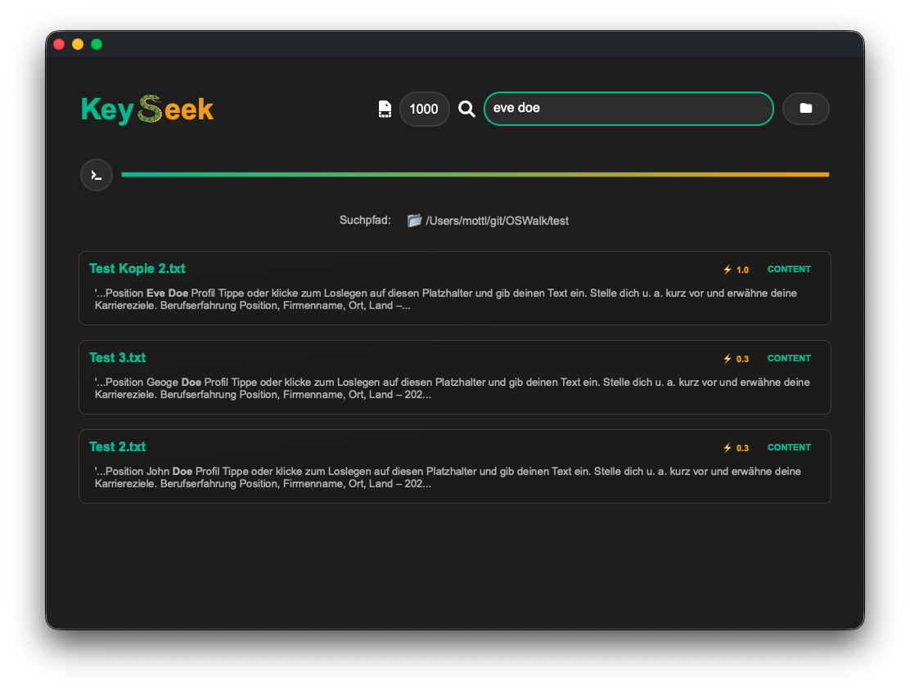
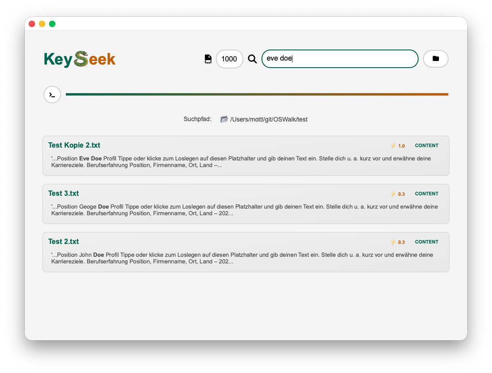

# OSWalk

Suchmaschine für den PC.
Eine Anwendung zum rekursiven Durchsuchen von Dateiinhalten in einem ausgewählten Ordner.
Ein Release zum Installieren sollte es bis 04 2026 geben.

## Features

- **Unterstützt Linux MacOSX Windows** - Suchmaschine für einen PC die wie Web Suchmaschinen funktioniert
- **Volltextsuche** - Dateien werden eingelesen und nach bestimmten Keywords durchsucht
- **Suchtiefe** - kann eingestellt werden nach Ziffern. bspw. nur die ersten 500 charakter im Dokument
- **GUI-Oberfläche** - Auswahl eines Hauptordners für die rekursive Suche
- **PDF-Suche** - Speziell: Suche nach Kundennummern Namen usw. im PDF Inhalt
- **optional OCR-Integration** - Texterkennung in PNG-Bildern mit pytesseract
- **Terminal** - print() wird in Console in GUI übergeben
- **Dateiformate** - können nach Belieben eingebaut werden vorerst alles was textract unterstützt
- **Suchtreffer** - Treffer im Dateinamen werden nicht im Inhalt durchsucht. Diese werden übersprungen
- **Multiprocessing und Multithreading** - für schnelles Suchen
- **Dark Theme Light Theme** - kann mit Betriebssystem umgeschaltet werden
- **Priority** - wird anhand der Stelle der Suchbegriffe berechnet (Max Muster Rechnung) = (3+2+1 ergibt Summe = 6) Das wird anschließend auf max. Priority 1.0 umgerechnet. Enthällt der Treffer nur (Muster) ist die Priority 2 / 6 = 0,33 gerundet 0,3. Siehe Screenshots unten.
- **Content Search** - Wenn diese Priorität unter 0,5 ist wird die Content Suche gemacht. über 0,5 ist es ein Filename Treffer und die Contentsuche wird übersprungen. Findet er im Filepath (Filename) gar nichts wird die Contentsuche immer gemacht. 

## TODOs bis Release
- print Terminal Ausgaben unvollständig
- Code Review und Kommentierung
- Pages zum weiterschalten bei vielen Treffern

## Screenshot App Main Page
### PySide (enthällt auch QSS zum Stylen) und wird für die App jetzt verwendet

### bootstrapttk Design wird nicht mehr verwendet für die App

